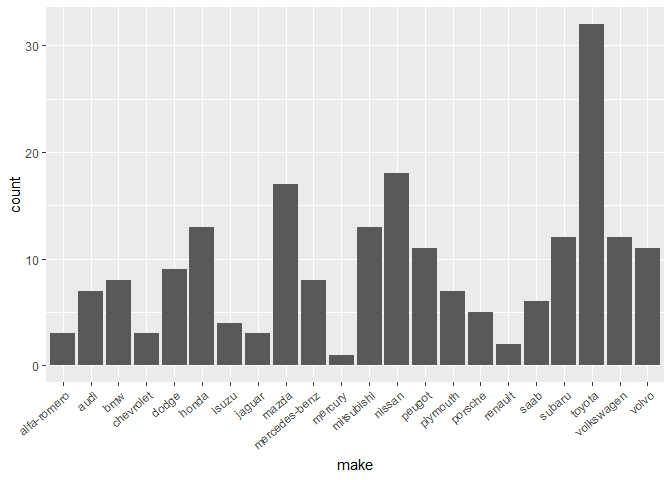
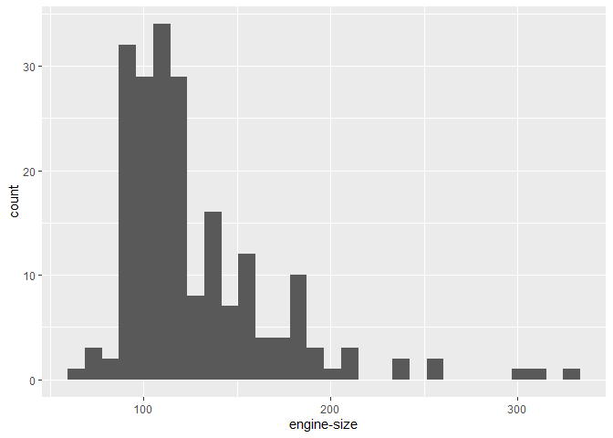
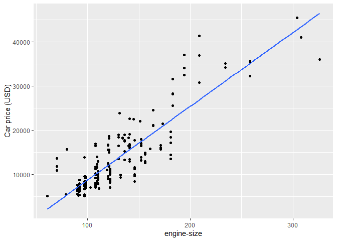

<!-- README.md is generated from README.Rmd. Please edit that file -->

# carpriceprediction

<!-- badges: start -->


<!-- badges: end -->

This package is designed to assist in the exploration and visualization
of data related to car attributes such as make, length, and other
important factors that can affect pricing. The functions within the
package allow users to preprocess the data, perform regression analysis,
and evaluate model performance.

## Installation

You can install the development version of carpriceprediction from
[GitHub](https://github.com/) with:

``` r
# install.packages("devtools")
devtools::install_github("DSCI-310/dsci-310-group-07-pkg")
```

## Usage

In order to use the functions in the package, load the
`carpriceprediction` library:

``` r
library(carpriceprediction)
```

### Data

In this example, we will use the actual `automobile` dataset. And the
first 6 lines of `automobile` is as follows:

    #> # A tibble: 6 × 26
    #>   symbol…¹ norma…² make  fuel-…³ aspir…⁴ num-o…⁵ body-…⁶ drive…⁷ engin…⁸ wheel…⁹
    #>   <fct>      <dbl> <fct> <fct>   <fct>   <fct>   <fct>   <fct>   <fct>     <dbl>
    #> 1 3             NA alfa… gas     std     two     conver… rwd     front      88.6
    #> 2 3             NA alfa… gas     std     two     conver… rwd     front      88.6
    #> 3 1             NA alfa… gas     std     two     hatchb… rwd     front      94.5
    #> 4 2            164 audi  gas     std     four    sedan   fwd     front      99.8
    #> 5 2            164 audi  gas     std     four    sedan   4wd     front      99.4
    #> 6 2             NA audi  gas     std     two     sedan   fwd     front      99.8
    #> # … with 16 more variables: length <dbl>, width <dbl>, height <dbl>,
    #> #   `curb-weight` <dbl>, `engine-type` <fct>, `num-of-cylinders` <fct>,
    #> #   `engine-size` <dbl>, `fuel-system` <fct>, bore <dbl>, stroke <dbl>,
    #> #   `compression-ratio` <dbl>, horsepower <dbl>, `peak-rpm` <dbl>,
    #> #   `city-mpg` <dbl>, `highway-mpg` <dbl>, price <dbl>, and abbreviated
    #> #   variable names ¹​symboling, ²​`normalized-losses`, ³​`fuel-type`, ⁴​aspiration,
    #> #   ⁵​`num-of-doors`, ⁶​`body-style`, ⁷​`drive-wheels`, ⁸​`engine-location`, …

### EDA

``` r
n <- 2 # n should be no larger than 25
(getR2(automobile,n))
#>   r_sqr       names
#> 1 0.796        make
#> 2 0.761 engine-size
```

``` r
plots <- plotAll(automobile, c("make","engine-size"))
# `make` is a factor, hence show the barplot
plots[[1]]
```



``` r
# `engine-size` is continuous, henshow show the histogram and scatterplot with a linear regression line
plots[[2]]
```



``` r
plots[[3]]
```



### Fit models

``` r

# By specifying the set = "basic", the result contains all columns
training_df<-get_tr_tst(automobile,"basic")[[1]]
testing_df<-get_tr_tst(automobile,"basic")[[2]] 

# By specifying the set = "at", the result contains all columns except ID
training_df_at<-get_tr_tst(automobile,"at")[[1]]
testing_df_at<-get_tr_tst(automobile,"at")[[2]]

# By specifying the set = "sub", the result contains columns except ID or categorical variables with more than 2 levels
training_df_sub<-get_tr_tst(automobile,"sub")[[1]]
testing_df_sub<-get_tr_tst(automobile,"sub")[[2]] 
```

``` r
# training matrices
training_matrices <- get_trm_tsm(training_df_sub, 
                                 testing_df_sub, 
                                 set = "training")
x_train_mat <- training_matrices[[1]]
y_train_mat <- training_matrices[[2]]

# testing matrices
testing_matrices <- get_trm_tsm(training_df_sub, 
                                testing_df_sub, 
                                set = "testing")
x_test_mat <- testing_matrices[[1]]
y_test_mat <- testing_matrices[[2]]
```

Lasso regression:

``` r
# Lasso regression
lasso_mods <-
  get_model_plot(x_train_mat, 
                 y_train_mat, 
                 model = "lasso", 
                 ask = "modeling")

# model with lambda resulting in minimum mse
lasso_mod <- lasso_mods[[1]]

# model with lambda resulting in (minimum mse + 1SE)
lasso_mod_1se <- lasso_mods[[2]]

# Training results with all lambdas
lasso_cv <- lasso_mods[[3]]

# visualize lasso_cv:
# get_model_plot(x_train_mat, y_train_mat, model = "lasso", ask = "plot")
```

Ridge regression:

``` r
ridge_mods <-
  get_model_plot(x_train_mat, 
                 y_train_mat, 
                 model = "ridge", 
                 ask = "modeling")

# model with lambda resulting in minimum mse
ridge_mod <- ridge_mods[[1]]

# model with lambda resulting in (minimum mse + 1SE)
ridge_mod_1se <- ridge_mods[[2]]

# Training results with all lambdas
ridge_cv <- ridge_mods[[3]]

# visualize ridge_cv:
# get_model_plot(x_train_mat, y_train_mat, model = "ridge", ask = "plot")
```

Performance of different models:

``` r
get_er_cv(training_df_at, training_df_sub, kfolds = 10, lasso_cv, ridge_cv)
#> # A tibble: 5 × 2
#>   Model                             R_MSE
#>   <chr>                             <dbl>
#> 1 LASSO Regression with minimum MSE  812.
#> 2 LASSO Regression with 1SE MSE      709.
#> 3 Ridge Regression with minimum MSE  808.
#> 4 LASSO Regression with 1SE MSE      856.
#> 5 OLS Full Regression                783.
```

## Code of Conduct

Please note that the carpriceprediction project is released with a
[Contributor Code of
Conduct](https://contributor-covenant.org/version/2/1/CODE_OF_CONDUCT.html).
By contributing to this project, you agree to abide by its terms.
